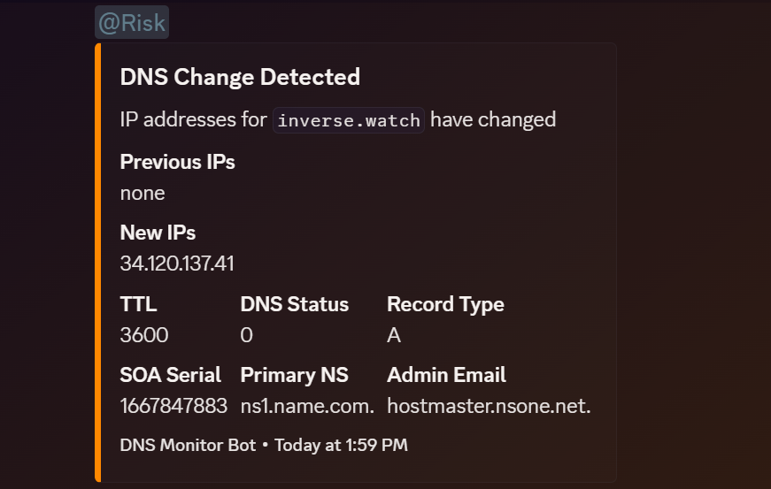

# DNS Monitor Bot - Discord Edition

A comprehensive DNS monitoring solution built on Cloudflare Workers that monitors DNS records for user-specified domains and provides real-time notifications and interactive management through Discord.

**Features:**
- 🔍 **Automated DNS Monitoring** - Tracks IP changes, SOA updates, and DNS authority status
- 🤖 **Interactive Discord Bot** - Manage domains with slash commands (`/add`, `/remove`, `/list`, `/status`)
- 📊 **Real-time Notifications** - Instant Discord alerts for DNS changes
- 💾 **Persistent Storage** - Dynamic domain management with Cloudflare KV
- 💰 **Cost Effective** - Designed to stay within Cloudflare's free tier
- ⚡ **Serverless Architecture** - No servers to maintain, scales automatically

The project combines traditional webhook notifications with modern Discord bot interactions for comprehensive DNS monitoring and management.

<p align="center">
  
  <br/>
  <i>Example Discord alert</i>
</p>

## Prerequisites

- [Node.js](https://nodejs.org/) (v20 or later)
- [npm](https://www.npmjs.com/) (comes with Node.js)
- [Wrangler CLI](https://developers.cloudflare.com/workers/wrangler/install-and-update/) (v4 or later)

## Setup

1. **Clone the repository:**

   ```bash
   git clone https://github.com/naouflex/dns-bot.git
   cd dns-bot
   ```

2. **Install dependencies:**

   ```bash
   npm install
   ```

3. **Configure your bot and secrets:**

   - Create a `.env` file in the project root and supply values:

     ```bash
     cp .env.example .env
     ```

   - Supply the same variables and values as GitHub Actions secrets within your repository's settings.[^1]

   - **Required Environment Variables:**

     ```bash
     # Discord Webhook Configuration (for notifications)
     DISCORD_WEBHOOK_URL=your_webhook_url_here
     DISCORD_ROLE_ID=your_role_id_here
     
     # Discord Bot Configuration (for slash commands)
     DISCORD_BOT_TOKEN=your_bot_token_here
     DISCORD_PUBLIC_KEY=your_public_key_here
     DISCORD_APPLICATION_ID=your_application_id_here
     
     # Cloudflare Configuration
     CLOUDFLARE_API_TOKEN=your_api_token_here
     
     # Optional: Static domains (can also manage via Discord commands)
     MONITOR_DOMAINS=domain1.com,domain2.com,domain3.com
     ```

   - Update `config.json` with your settings (optional if using Discord commands):

     ```json
     {
       "domains": ["domain1.com", "domain2.com"],
       "cron": "*/5 * * * *",
       "kvNamespace": {
         "id": "your-kv-namespace-id"
       }
     }
     ```

   - Get your Cloudflare API token[^2]
   
   - Create a Discord webhook[^3]

   - Get your Discord role id from the Discord server you want to monitor[^4]

   - Set up Discord bot for slash commands[^5]

4. **Set Discord bot environment variables:**

   ```bash
   # Set Discord bot secrets in Cloudflare Workers
   npx wrangler secret put DISCORD_BOT_TOKEN
   npx wrangler secret put DISCORD_PUBLIC_KEY
   npx wrangler secret put DISCORD_APPLICATION_ID
   ```

5. **Deploy the bot:**

   - **Option 1: Deploy locally**

     Run the deploy script:

     ```bash
     npm run deploy
     ```

     This will:

     - Set up the KV namespace if needed
     - Configure Discord webhook
     - Update the worker configuration
     - Deploy to Cloudflare Workers

   - **Option 2: Deploy via GitHub Actions**

     - Push your changes to the `main` branch.
     - The GitHub Action will automatically deploy the bot.

6. **Configure Discord Interaction Endpoint:**

   After deployment, set up the Discord interaction endpoint:

   1. Go to [Discord Developer Portal](https://discord.com/developers/applications)
   2. Select your application → **General Information**
   3. Set **"Interactions Endpoint URL"** to: `https://your-worker-name.workers.dev/`
   4. Click **"Save Changes"** (Discord will verify the endpoint)

7. **Register Discord Commands:**

   ```bash
   # Register slash commands (done automatically on deployment)
   curl -X POST https://your-worker-name.workers.dev/register-commands
   ```

## Viewing Logs

To view the logs for your deployed worker:

1. Go to the [Cloudflare Dashboard](https://dash.cloudflare.com/).
2. Navigate to **Workers & Pages**.
3. Select your worker (`dns-bot`).
4. Click on **Logs** to view the worker's logs.

## Alerting

The DNS Monitor Bot sends several types of notifications to your Discord channel:

### DNS Change Detected (Orange)
Triggered when IP addresses for a domain change. Includes:
- Previous and new IP addresses
- TTL information
- DNS status
- SOA serial number, primary nameserver, and admin email
- Mentions the specified Discord role to alert team members

### DNS Zone Updated (Light Blue)
Triggered when the SOA record changes but IP addresses remain the same. Includes:
- Previous and new SOA serial numbers 
- Primary nameserver information
- Admin email
- Zone timing parameters (refresh, retry, expire, minimum TTL)

### DNS Authority Unreachable (Yellow)
Triggered when the DNS authority for a domain becomes unreachable. Includes:
- Domain name
- Status information
- DNS comments from the resolver

### Error Monitoring DNS (Red)
Triggered when there's an error checking a domain. Includes:
- Error details
- Timestamp of the error

### New Worker Deployment (Light Blue)
Triggered when a new version of the worker is deployed. Includes:
- Previous and new version IDs
- List of monitored domains
- Deployment timestamp

## Discord Bot Commands

The DNS Monitor Bot provides interactive slash commands for dynamic domain management directly from Discord:

### Available Commands

#### `/help`
Shows all available commands with current bot status.
- Displays current domain count
- Shows last check timestamp
- Lists all command descriptions

#### `/list`
Lists all monitored domains, separated into:
- **Static domains** (configured via `MONITOR_DOMAINS` environment variable)
- **Dynamic domains** (added via Discord commands)
- **Total count** of monitored domains

#### `/add <domain>`
Adds a single domain to DNS monitoring.
- **Example:** `/add example.com`
- Validates domain format
- Prevents duplicate entries
- Updates bot status automatically
- Shows who added the domain

#### `/add-with-subdomains <domain>` **NEW!**
Discovers and adds real subdomains using Certificate Transparency logs.
- **Example:** `/add-with-subdomains example.com`
- **Advanced:** `/add-with-subdomains example.com verify-all:true`
- Queries Certificate Transparency logs (crt.sh) to find real subdomains
- Automatically adds discovered subdomains that have valid DNS records
- Much more efficient than hardcoded subdomain lists
- Option `verify-all`: Verifies all discovered domains are active (slower but more accurate)
- Falls back to common subdomains if CT discovery fails
- Discovers legitimate subdomains that actually exist with SSL certificates

#### `/remove <domain>`
Removes a domain from DNS monitoring.
- **Example:** `/remove example.com`
- Cleans up all stored DNS data for the domain
- Updates bot status automatically
- Shows who removed the domain

#### `/status <domain>`
Check current DNS status of a specific domain.
- **Example:** `/status example.com`
- Shows current IP addresses
- Displays DNS status and SOA serial
- Shows primary nameserver and admin email
- Compares with last known state

### Domain Management

#### Static vs Dynamic Domains
- **Static domains:** Configured via `MONITOR_DOMAINS` environment variable
- **Dynamic domains:** Added/removed via Discord commands
- **Persistent storage:** Dynamic domains are stored in Cloudflare KV and survive restarts
- **Both types** are monitored equally during scheduled checks

#### Permissions
- Commands are available to all Discord server members by default
- Use Discord's role-based permissions to restrict access:
  1. Server Settings → Integrations → DNS Monitor Bot → Manage
  2. Restrict commands to specific roles or channels

### Bot Status

The bot displays live status information:
- **Commands show:** Real-time domain count and last check time
- **Profile description:** Updates with current monitoring status
- **Appears offline:** Normal behavior for Cloudflare Workers (slash commands work perfectly)

### Usage Examples

```
# Get help and see current status
/help

# List all monitored domains
/list

# Add single domain to monitoring
/add newsite.com

# Add domain and discover all its subdomains automatically
/add-with-subdomains github.com

# Add domain with full verification (slower but more accurate)
/add-with-subdomains example.com verify-all:true

# Check specific domain status
/status curve.finance

# Remove domains from monitoring
/remove oldsite.com
```

## Worker Endpoints

The worker provides several HTTP endpoints:

- **`GET /`** - Shows worker information and available endpoints
- **`POST /`** - Discord interactions endpoint (for slash commands)
- **`GET /status`** - JSON status of worker, bot, and monitored domains
- **`POST /register-commands`** - Manually register Discord slash commands

### Status Endpoint Example

```bash
curl https://your-worker-name.workers.dev/status
```

Returns:
```json
{
  "worker": {
    "status": "running",
    "version": "eb61e8bf-aa08-42b6-ba1b-5b9046aee41e",
    "discordBotConfigured": true,
    "webhookConfigured": true
  },
  "bot": {
    "online": true,
    "activity": "Watching 3 domains | Last: 14:22 UTC",
    "lastCheck": "2025-01-10T14:22:17.127Z"
  },
  "domains": {
    "static": ["inverse.finance", "curve.finance", "inverse.watch"],
    "dynamic": [],
    "total": 3
  }
}
```

## Troubleshooting

### General Issues
- **Wrangler not found:** Ensure Wrangler is installed globally or use `npx wrangler`.
- **Deployment fails:** Check your API token and ensure all environment variables are set correctly.
- **No logs:** Ensure logging is enabled in your `wrangler.toml` file.
- **GitHub Actions fails:** Verify that all required secrets are set in your repository's Settings > Secrets and variables > Actions.

### Discord Webhook Issues
- **No Discord notifications:** Check that your webhook URL is correct and that the bot has permission to post in the channel.
- **Webhook errors:** Verify the webhook URL hasn't been deleted or regenerated in Discord.

### Discord Bot Issues
- **Commands not appearing:** 
  1. Verify `DISCORD_APPLICATION_ID` is set correctly
  2. Check that the bot was invited with `applications.commands` scope
  3. Try manually registering commands: `curl -X POST https://your-worker-name.workers.dev/register-commands`
  
- **Commands not working:**
  1. Check that `DISCORD_PUBLIC_KEY` is set correctly
  2. Verify the Interactions Endpoint URL in Discord Developer Portal
  3. Check worker logs for authentication errors
  
- **Bot appears offline:** This is normal for Cloudflare Workers - the bot can't maintain persistent connections. Slash commands work perfectly despite appearing offline.

- **Interaction endpoint verification fails:**
  1. Ensure worker is deployed first
  2. Check that all Discord environment variables are set
  3. Verify the endpoint URL matches your worker URL exactly

### DNS Monitoring Issues
- **No DNS monitoring:** 
  1. Ensure either `MONITOR_DOMAINS` is set or domains are added via `/add` command
  2. Check that the scheduled trigger is working (cron runs every minute)
  3. Verify domains are accessible and have valid DNS records

- **Missing domain data:** Check the `/status` endpoint to see current domain configuration

## Footnotes

[^1]: Required secrets must be set in both your local `.env` file and GitHub Actions repository secrets. Go to your repository's Settings > Secrets and variables > Actions and add: `CLOUDFLARE_API_TOKEN`, `DISCORD_WEBHOOK_URL`, `DISCORD_ROLE_ID`, `DISCORD_BOT_TOKEN`, `DISCORD_PUBLIC_KEY`, and `DISCORD_APPLICATION_ID`.

[^2]: To get your Cloudflare API token:

    1. Go to the [Cloudflare Dashboard](https://dash.cloudflare.com/)
    2. Navigate to **My Profile** > **API Tokens**
    3. Click **Create Token**
    4. Choose **Create Custom Token**
    5. Set the following permissions:
       - **Account** > **Workers** > **Edit**
       - **Zone** > **DNS** > **Read**
    6. Set the **Account Resources** to **All accounts**
    7. Set the **Zone Resources** to **All zones**
    8. Click **Continue to summary** and then **Create Token**

[^3]: To create a Discord webhook:

    1. Open Discord and go to the server where you want to receive notifications
    2. Go to Server Settings > Integrations > Webhooks
    3. Click "New Webhook"
    4. Give it a name (e.g., "DNS Monitor")
    5. Select the channel where notifications should be sent
    6. Click "Copy Webhook URL"
    7. Paste this URL as your `DISCORD_WEBHOOK_URL` in the `.env` file and GitHub secrets

[^4]: To get your Discord role id:

    1. Open Discord and go to the server where you want to receive notifications
    2. Go to Server Settings > Roles
    3. Hover over the role you want to monitor and click "Copy ID"

[^5]: To set up Discord bot for slash commands:

    1. Go to [Discord Developer Portal](https://discord.com/developers/applications)
    2. Click "New Application" and give it a name (e.g., "DNS Monitor Bot")
    3. Go to **Bot** section → "Add Bot" 
    4. Copy the **Bot Token** (for `DISCORD_BOT_TOKEN`)
    5. Go to **General Information** section
    6. Copy the **Application ID** (for `DISCORD_APPLICATION_ID`)
    7. Copy the **Public Key** (for `DISCORD_PUBLIC_KEY`)
    8. Go to **OAuth2** → **URL Generator**
    9. Select scopes: `applications.commands` and `bot`
    10. Select permissions: "Use Slash Commands", "Send Messages", "Embed Links"
    11. Use the generated URL to invite the bot to your Discord server
